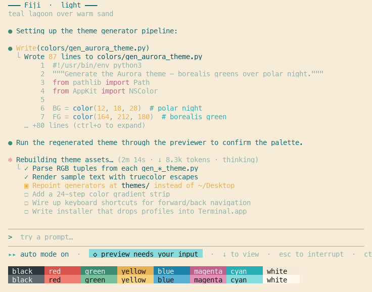

# Terminal Themes

A small collection of macOS Terminal.app color themes — story-rich palettes pulled from beaches, gardens, sunsets, and groves. Three tiers (light, dim, dark), all generated from standalone Python scripts so palettes stay editable in one place.

## Themes

### Light
Cream/sand backgrounds, deep botanical text. For bright rooms.

| Preview | Theme |
|---|---|
|  | **Fiji** — teal lagoon over warm sand |
|  | **Cottage Floral** — English garden blooms over magnolia cream |
|  | **Hawaiian Beach** — sunny tropical, palm green over warm sand |
|  | **Pastel Watercolor** — soft washed blooms |
|  | **Pink Wisteria** — cascading blossoms in dappled sun |

### Dim
Mid-tone backgrounds (~100–130 luma): lower glare than light, no high-contrast jolt of true dark. The compromise tier.

| Preview | Theme |
|---|---|
|  | **Olive Grove Noon** — silvery sage in Mediterranean midday |
|  | **Sea Fog** — Pacific morning fog over the tide-line |
|  | **Terracotta Tile** — sun-warmed clay in a Mediterranean alley |

### Dark
Warm dark — sunsets, twilights, woodsides, lantern-lit gardens. No cold blue-blacks.

| Preview | Theme |
|---|---|
|  | **Lava Rock Beach** — black-sand shore under tropical stars |
|  | **Mauna Kea Sunset** — molten sunset over volcanic twilight |
|  | **Moody Wildflower** — dusk meadow palette |
|  | **Redwood Nightfall** — coastal redwood grove at dusk |
|  | **Velvet Garden** — English walled garden at dusk, lantern-lit |

## Installing

Double-click any `.terminal` file from `themes/<bucket>/`, then in **Terminal → Settings → Profiles** select the new profile and click **Default** to make it stick across new windows.

If a re-import collides with an existing profile of the same name, delete the old profile in Terminal first.

## Layout

```
themes/
  light/   *.terminal      ← what you double-click
  dim/     *.terminal
  dark/    *.terminal
colors/
  light/   gen_*_theme.py  ← edit RGB values here, re-run to rebuild
  dim/     gen_*_theme.py
  dark/    gen_*_theme.py
screenshots/<bucket>/<name>.png
preview.py            ← step through every theme inline (truecolor)
gen_screenshots.py    ← rebuild the README screenshots
```

Bucket-folder name is the only source of truth for "is this light/dim/dark?" — moving a generator between buckets automatically reroutes its `.terminal` output and its preview ordering.

## Previewing in your current terminal

```bash
/usr/bin/python3 preview.py
```

Renders every palette inline using 24-bit truecolor escapes, so colors display correctly regardless of which theme your terminal is currently using. Press Enter to step through, Ctrl-C to quit. Each panel mimics the Claude Code interface (bullets, tool calls, dimmed code block, ✓/▣/☐ checkboxes, status bar) so you can see how the palette feels in real use.

## Tweaking a palette

Each `colors/<bucket>/gen_<name>_theme.py` is self-contained. The palette is a block of `color(r, g, b)` calls near the top of the file — edit RGB values, then re-run:

```bash
/usr/bin/python3 colors/light/gen_fiji_theme.py
```

The output `.terminal` file lands in `themes/<same-bucket>/` automatically. Re-import in Terminal (delete the old profile first if the name collides).

To refresh the README screenshots:

```bash
/usr/bin/python3 gen_screenshots.py
```

## Adding a new theme

1. Pick a bucket based on background luminance:
   - `light` — luma > ~200 (cream, sand, paper)
   - `dim`   — luma ~100–130 (fog, olive shadow, clay, weathered stone)
   - `dark`  — luma < ~50 (twilight, basalt, deep wood)
2. Copy any existing generator into `colors/<bucket>/` and rename it
3. Edit the palette tuples + the `name` field + the filename in `out =`
4. Update the docstring's first line — `preview.py` shows the part after ` — ` as the tagline under the banner
5. Run the generator, then `gen_screenshots.py` to refresh the README

## Why scripts and not just `.terminal` files

Color values in a `.terminal` file are not hex strings — they're `NSKeyedArchiver`-archived `NSColor` blobs (sRGB), embedded as base64 `<data>` in the XML plist. Terminal.app rejects plain hex in those slots. The `color(r, g, b)` helper at the top of each generator wraps that archive step; it's the only sane way to produce a valid blob, since hand-editing the XML doesn't work.

## Requirements

System Python at `/usr/bin/python3` with PyObjC (for the generators) and Pillow (for the screenshot script). PyObjC ships with macOS's bundled Python; Pillow doesn't. On a fresh machine:

```bash
/usr/bin/python3 -m pip install --user pyobjc-framework-Cocoa pillow
```
